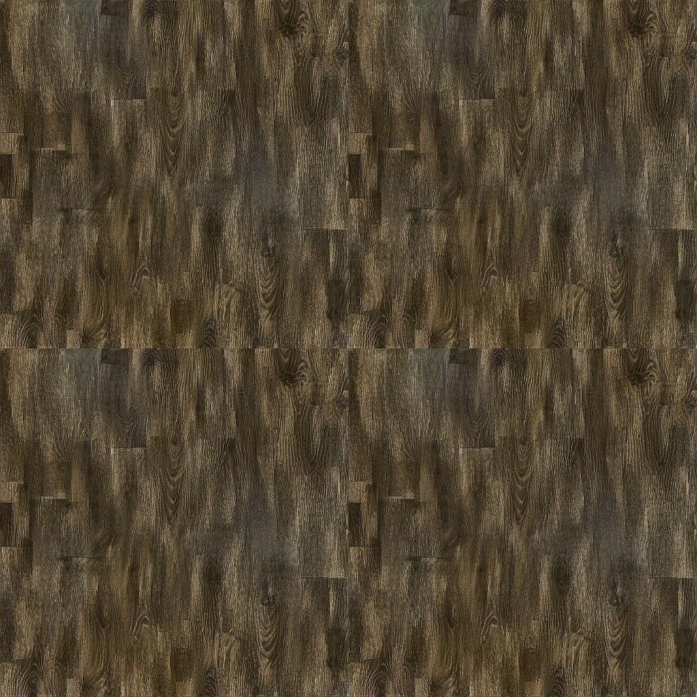
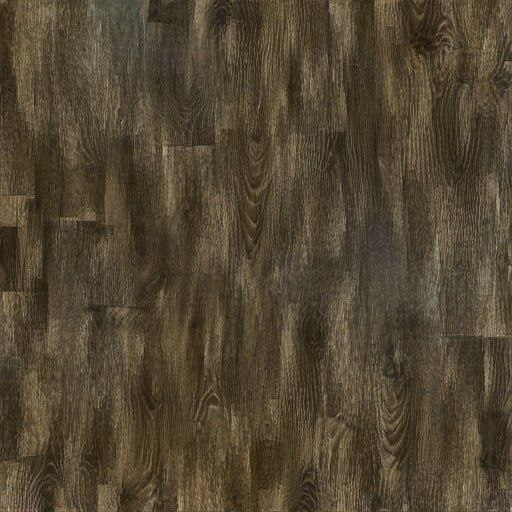
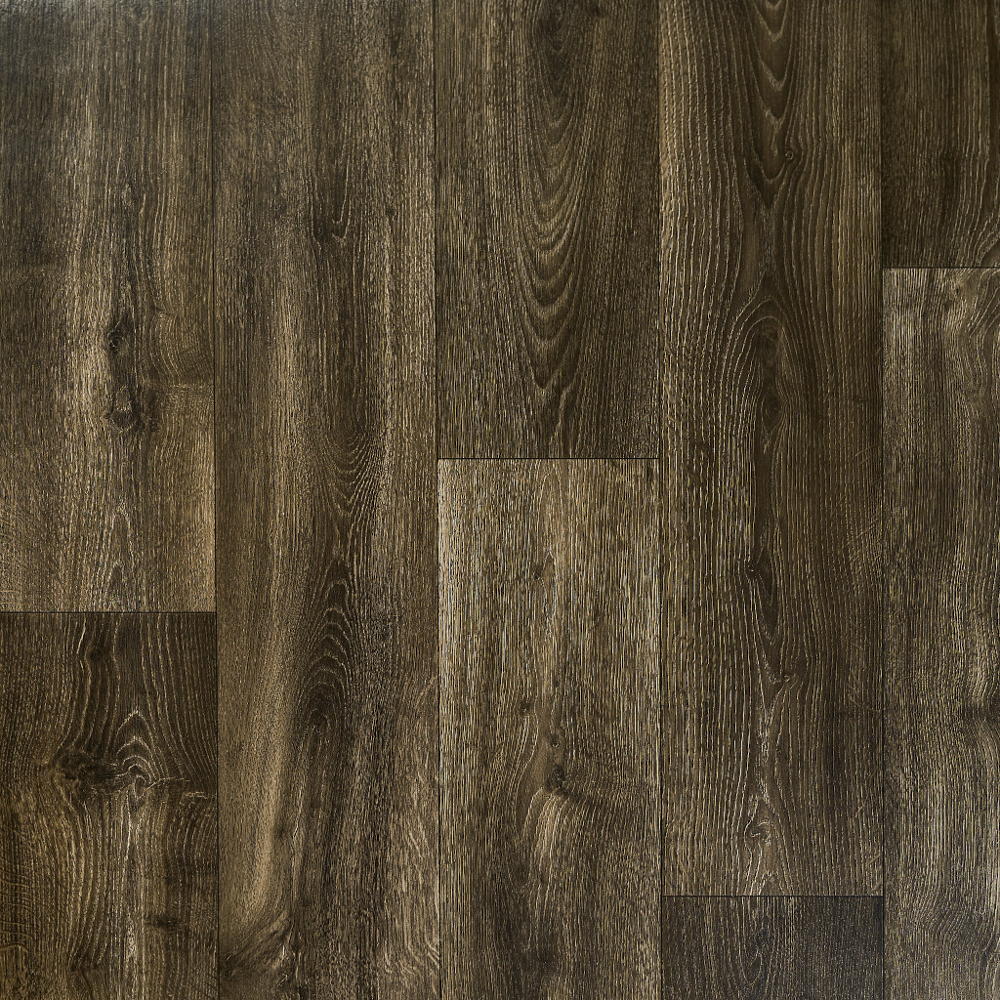
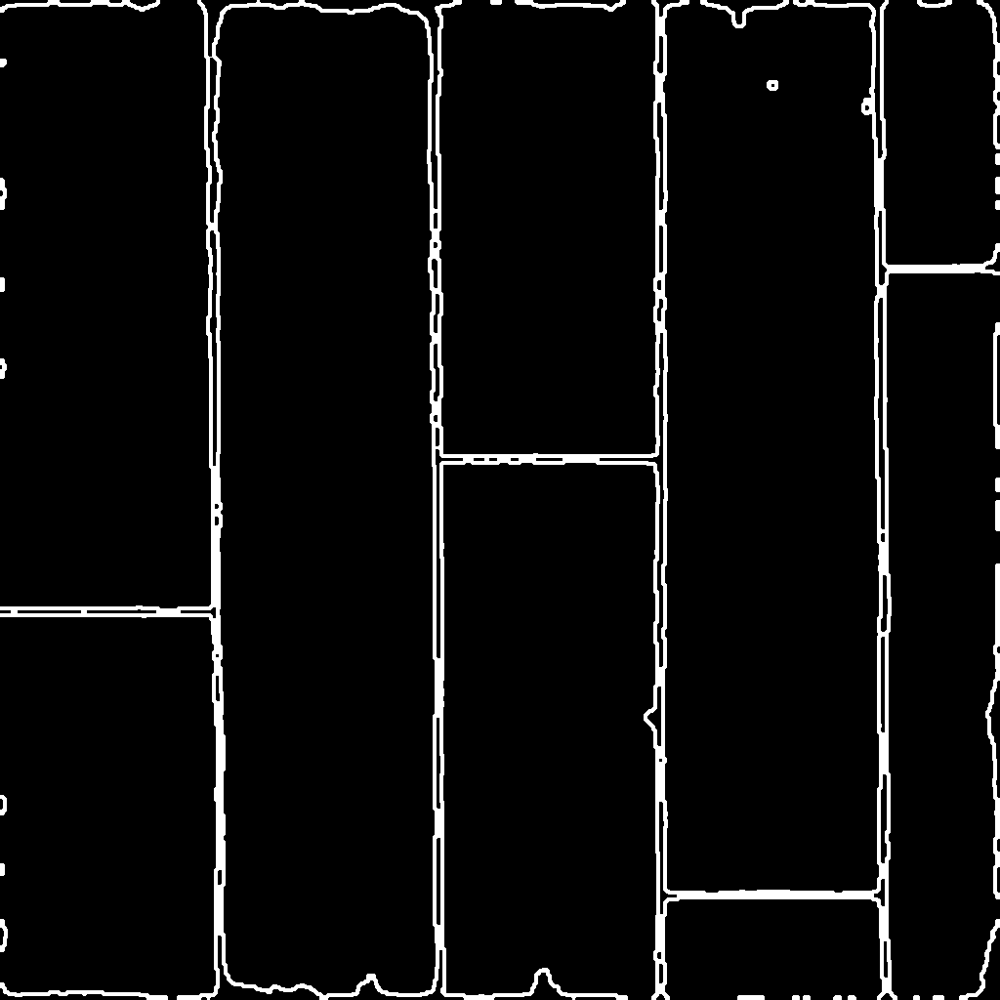
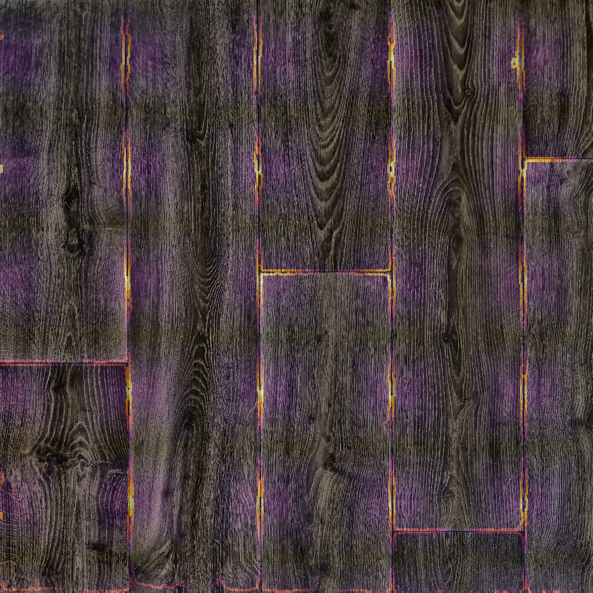
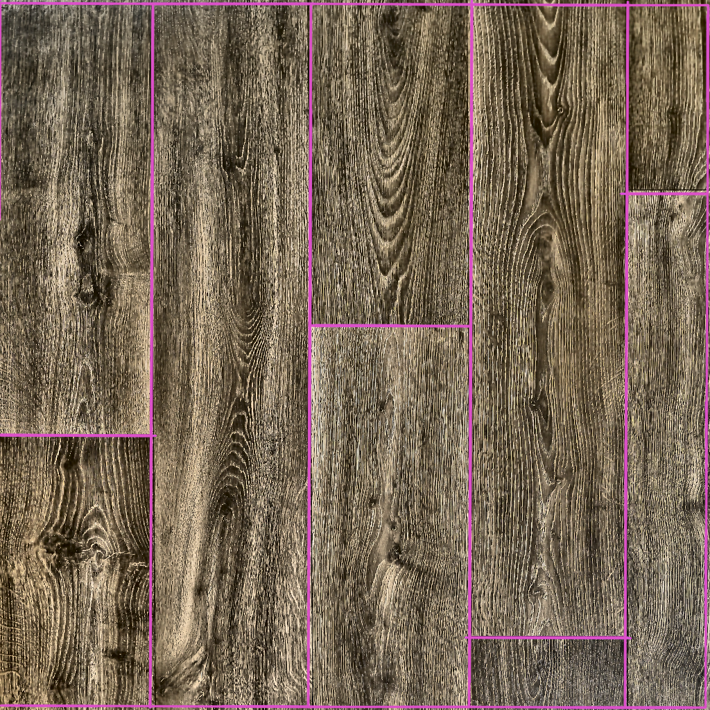

# Progress report

## Previous solutions

### Naive - pick a metric and let agent iterate on it

I've found [TexTile](https://arxiv.org/abs/2403.12961) and LLM suggested some other metrics I haven't kept track of. The idea was to let an agent iterate for some time and try various solutions. I haven't steered it in this direction and it got stuck in one approach instead. I also didn't know that models can natively view images in Cursor, so the agentic loop would probably be way more useful if I utilized this feature.

### Lazy - generate with a neural net runnable on my machine

In the TexTile paper they try using their metric as a loss component, and it significally improves quality. I have tried running [Neural Texture Synthesis](https://github.com/tchambon/A-Sliced-Wasserstein-Loss-for-Neural-Texture-Synthesis) with TexTile as loss and got nothing to show for it: model generates something of similar distribution, but is completely oblivious to the nuance.

#### Result examples

| [`textile_preview.jpg`](result_example/textile_preview.jpg) | [`textile_tile.jpg`](result_example/textile_tile.jpg) |
|:-:|:-:|
|  |  |

## Current solution

I chose the plank extraction route - mainly based on its straightforwardness, but we can also generate more pieces after extraction by

- mirroring and rotating
- taking a few parts of the plank and making some model fill the gaps

However, this approach deviates from the goal of having a single tile that would be repeated many times in each direction, since in general we cannot assemble a square from planks when there is a shift in each next row/column.

The solution is only capable of extracting planks (specifically for `[samples/dark.png](samples/dark.png)`) and is very sensitive to the configuration parameter values. I couldn't make it work with `[samples/herringbone.png](samples/herringbone.png)` yet.

#### Result

Example run on [`samples/dark.png`](samples/dark.png), artifacts in [`result_example/`](result_example/):

| [`dark.png`](result_example/dark.png) | [`dark_boundary_ridge.png`](result_example/dark_boundary_ridge.png) | [`dark_grid_residuals.png`](result_example/dark_grid_residuals.png) | [`dark_plank_rectangles.png`](result_example/dark_plank_rectangles.png) |
|:-:|:-:|:-:|:-:|
|  |  |  |  |

### The pipeline

Preprocessing → SAM3 segmentation → grid construction → plank extraction  

The path forward is:
1. Keeping only planks that all match in one dimension
2. Augmenting the set of planks
3. Calculating the shift in each next row/column
4. Randomly arranging 

#### Preprocessing

1. **Input:** Full-resolution image.
2. **Apply bilateral denoise**
  - Reduces speckle noise while preserving edges.
3. **Apply lighting normalization**
  - Flat-field style correction.
  - Adaptive histogram equalization (CLAHE) to correct uneven illumination.
4. **Letterbox image**
  - Resize and pad image to a fixed square, aligned to model’s stride.
  - Output: letterboxed tensor for SAM.
5. **Unwarp masks (after segmentation)**
  - Prepare mapping to restore mask coordinates to original image resolution.

#### SAM3 Segmentation

1. **Input:** Letterboxed, normalized image; (comma-separated) text prompt(s).
2. **Run SAM3 segmentation**
  - Use Ultralytics SAM3 with specified confidence and device.
  - Generate instance masks and diagnostic outputs (e.g., plots, mask sum).
3. **Unletterbox masks (if needed)**
  - Remap predicted masks from letterboxed size back to original geometry for further processing.

#### Grid Construction

1. **Input:** Instance masks and lighting-normalized, full-resolution image.
2. **Filter masks**
  - Remove based on area thresholds.
3. **Dilate mask boundaries**
  - Enhances boundary evidence for grid fitting.
4. **Fit plank grid**
  - Apply (e.g.) border-based grid alignment within angle tolerance.
5. **Output diagnostics**
  - Emit grid geometry, overlays on the image, and JSON with fit parameters.

#### Plank Extraction

1. **Input:** Fitted grid, normalized image.
2. **Crop plank regions**
  - Extract image regions corresponding to each plank cell in the grid.
3. **Save outputs**
4. **Yield final tiles**

